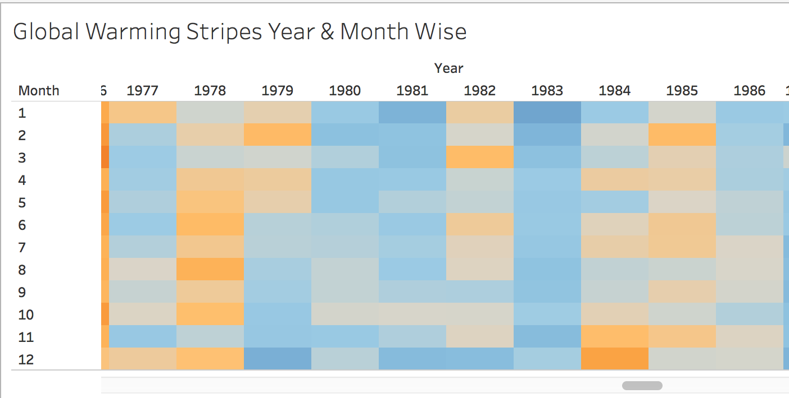

# Data Visualizations On Climate Change Caused By Humans

## Introduction

Earth has surpassed 4.5 billion years of life span with human interventions possibly dating back since the last 200,000 years. We are currently facing extreme weather events which has raised so many questions on human activities. Indeed it is true that humans have increased the hydro carbon energy consumption multifold in the last 5 decades. Today's extreme weather conditions such as forest fires, shrinkage in ice mass, rise in sea level, severe flooding due to extreme rain or snow or cyclonic depressions, severe drought for extended period of time etc, are often attributed to global warming. Here we will analyze, evaluate 5 visuals, infer, summarize and replicate warming stripe visual.We will evaluate the 5 visuals on the following principles.

   * Evidence
   * Intuitiveness
   * Perspective
   * Persuade
   * Completeness 
   * Inspire action

[Source: [Principles](https://www.perceptualedge.com/articles/visual_business_intelligence/data_visualization_effectiveness_profile.pdf)]

 "Climate Change" and "Global Warming" are almost used synonymously everywhere. Global warming refers to global temperature changes due to increasing concentrations of greenhouse gases in atmosphere. Climate change refers to changes in measures of climate over a period of time such as rainfall, snow, temperature, wind patterns, intensity of extreme weather events (such as hurricanes, volcanic eruptions etc).
NASA cites global warming as a significant contributor to modern climate changes[[Nasa Evidence](https://climate.nasa.gov/evidence)]. Humans have significant foot print in global warming changes and hence the climate change. Scientists from both the isles differ on agreeing that human carbon dioxide emissions from human activities are the root cause of this alarming change.

[Source: [Definitions](https://www.usgs.gov/faqs/what-difference-between-global-warming-and-climate-change-1?qt-news_science_products=0#qt-news_science_products)]

### Evaluation
						Figure-1

[Source Graph: [Paleoclimate](https://earthobservatory.nasa.gov/features/GlobalWarming/page3.php)] 

First the evidence, Scientists have studied the evidence from tree rings, air trapped in ice glaciers, ocean sediments, coral reefs and also some sedimentary rocks to collect the history of earth warming trends. Scientists could trace the history and recreate the global warming trend since the last 800,000 years. Using this evidence, they have recreated a record of earth's past climates which is called "paleoclimates". The above figure shows rate of temperature change over time using Paleoclimate model. It is very intuitive that the current trend of temperature increase over the last couple of decades is very high compared to the past.

Evidential Data from the history shows a 5 degree Celsius change took about 5000 to 7000 years. From the above graph, you see that in the last century alone the temperature increase is 0.7 degree celsius which is 10 times faster than the average. Models predict that the earth will be warmer by 2 to 6 degree Celsius in the next 100 years which is 20 times faster than the average. This rate is very alarming as it will get out of control pretty quickly.

This graph gives a great perspective that indeed global warming is happening now and what we are witnessing now is the effect of warming trend. This graph is sufficient and complete to prove sufficiently the correlation between the warming trend and extreme. This projection of alarming trend 20 times faster to reach 2 degree Celsius inspires action to engage and explore further.

						Figure-2

[Source: Graph based on [Data](https://www.bloomberg.com/graphics/2015-whats-warming-the-world/data/forcings.csv)]
The data sourced the activities as follows.
Human activities include
	* Green house gas (GHG) emission 
	* Anthropogenic tropospheric aerosol
	* Land use
	* Ozone changes
Natural activities include
	* solar flares and solar storms
	* volcanic eruptions in earth and ocean
	* Orbital changes

The above graph is drawn by me using the data cited above. It intuitively shows humans are major contributors to this global warming trend. Data collected also showed the biggest contributor is GHG and it is significantly larger in the last 60 to 70 years. This also gives a perspective on human interference in global eco system change. This graphs persuades the reader to explore further on GHG and how to reduce the GHG emissions.

						Figure-3:

[Source Image: [Skeptical Perspective](https://cei.org/blog/climate-change-fossil-fuels-and-human-well-being?gclid=EAIaIQobChMIstiUqonO4QIVTrXACh2hQgdjEAMYASAAEgIYHvD_BwE)]

Well, hearing from the skeptics isle that not all effect is caused by humans and GHG effect is very minimal to increase temperature by 0.7 degree Celsius. Global warming and cooling is a phenomenon that existed before and is repeating now. The graph argues that Ice mass shrink (which is reported by Global warming Scientists as an effect of global warming) started a century before humans started consuming hydro carbon energy at a mass scale as energy source. Even though humans have achieved great technological milestones in every field there are few developing countries which is not fully electrified. Other sources cite that every country in the past 50 decades is showing greater GDP growth, lower mortality rate, lower fatalities rates in warm climate epidemic diseases such as malaria, measles, chicken pox etc.

This is just one side of the argument. I find the skeptics do not realize the full picture of global warming trend. I agree that the trend of ice shrink started more than a decade ago, but let's zoom in on the recent rate of increase of the shrinkage. It is directly proportional to the current global warming trend. If the warming rate could increase 0.7 degree Celsius in 70 years, it would take 700 years to reach 7 degree Celsius increase which is 7 to 10 times faster than the average of 5000 to 7000 years. A 5 degree Celsius increase in global temperature would destroy fragile plants and animals on earth, fragile sea life and would render billions of humans in famine and drought. This would bring few species to be extinct and eventual mass destruction.

						Figure-4:

[Source Image: [Model](https://visme.co/blog/climate-change-facts/)]

The above picture (Figure-4) is very intuitive, engaging and persuading. If humans continue to consume conventional fuel sources and continue to emit carbon emissions at the current level we will hit 2 degree Celsius temperature increase by 2020. The extreme weather patterns will become worse and significant life and economic destruction will be imminent. This graph also models the impact of trends when there is 1.5 degree Celsius temperature increase by 2020. This is an eye opener for people and will help them to remember as a key take away!

						Figure-5:

[Source Image: [Inspire Model](https://www.wbcsd.org/Programs/Climate-and-Energy/Energy/New-Energy-Solutions/Resources/New-Energy-Solutions-for-1.5-C-Visual)]

The above graph (Figure-5) shows inspiring action plan to achieve 1.5 degree Celsius temperature increase target. This graph clearly shows the major contributor (41%) from conventional power production (solid fuel, natural gas and liquid fuels) and the second highest (24%) from conventional automobiles (cars, planes, ships and motors) . It shows a path for creating more natural renewable energy production (such as solar, wind), increasing production of electric cars, renovate the building heating or cooling infrastructures. It also shows the importance of involvement and commitment from various entities such as energy producers, society, individual users, governments, banks and financial institutions to be successful in this effort. Without commitment from any of these parties, we will not be able to mitigate the effect of global warming.

## Inference

* High correlation of current climatic change with increased rate of global warming.
* Human activities (conventional fuel consumption) is a major factor to contribute to global warming.
* Even though global warming and cooling existed in the past, the current rate of temperature increase is correlated with drastic climatic change.
* Ways to mitigate climate change is to use alternate source of renewable energy.
* Commitment is needed from various parties such as individual users, energy providers, governments, corporates, society and financial institutions to use renewable source of energy and to be successful in the efforts to mitigate global warming.

## Summary
* Humans need to act with responsibility. Every country needs to commit itself to use renewable source of energy. Every country needs to be sympathetic to other countries and provide technological help to produce energy using renewable sources.
Without combined efforts from every country the effort will not be complete and the mitigation target cannot be easily achieved.

## Reference

Nasa Evidence - https://climate.nasa.gov/evidence

## Warming Stripe Replication

[[Source: Data](https://www.metoffice.gov.uk/hadobs/hadcrut4/data/current/time_series/HadCRUT.4.6.0.0.monthly_ns_avg.txt)]
Tableau Code - [HadCRUT.4.6.0.0.monthly_ns_avg.twb](HadCRUT.4.6.0.0.monthly_ns_avg.twb)

Warming Stripe Image - 
